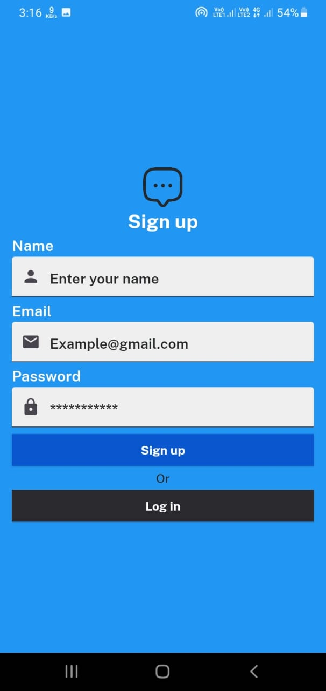

# Chat_Application

## Description

This project is a simple chat application built using Flutter and Firebase. It allows users to search for other users by email, initiate one-on-one chat rooms, and exchange messages in real-time.

## Table of Contents

*   [Installation](#installation)
*   [Usage](#usage)
*   [Screenshots](#screenshots) 
*   [Technologies Used](#technologies-used)

## Installation

A few resources to get you started if this is your first Flutter project:

- [Lab: Write your first Flutter app](https://docs.flutter.dev/get-started/codelab)
- [Cookbook: Useful Flutter samples](https://docs.flutter.dev/cookbook)

For help getting started with Flutter development, view the
[online documentation](https://docs.flutter.dev/), which offers tutorials,
samples, guidance on mobile development, and a full API reference.

To run the project locally, follow these steps:

1. Clone the repository to your local machine.

```https://github.com/SatyarthAgrahari/Chat_Application.git```

2. Navigate to the project directory.

```cd chat_app```

3. Install dependencies using Flutter's package manager, pub.

```flutter pub get```

4. Ensure you have Firebase project credentials and configuration set up.

5. Run the project on your Android device or simulator.

```flutter run```

## Usage

1. Launch the app on your device.

2. Log in using your credentials or create a new account if you don't have one.

3. Use the search bar to find other users by email.

4. Tap on a user to open a chat room.

5. Type your message in the text field at the bottom of the screen and press send.

6. Chat messages will be displayed in the chat room in real-time.


## Screenshot

### Splash Screen


### Signup Screen



### Login Screen


### Home Screen


### Chat Room


## Technologies Used

* Flutter: A UI toolkit for building natively compiled applications for mobile, web, and desktop from a single codebase.

* Firebase: A platform developed by Google for creating mobile and web applications.

    * Firebase Authentication: Provides backend services, easy-to-use SDKs, and ready-made UI libraries to authenticate users to your app.

    * Cloud Firestore: A flexible, scalable database for mobile, web, and server development.

* VelocityX: A minimalist Flutter framework for rapid UI development, providing expressive syntax and pre-built widgets.


